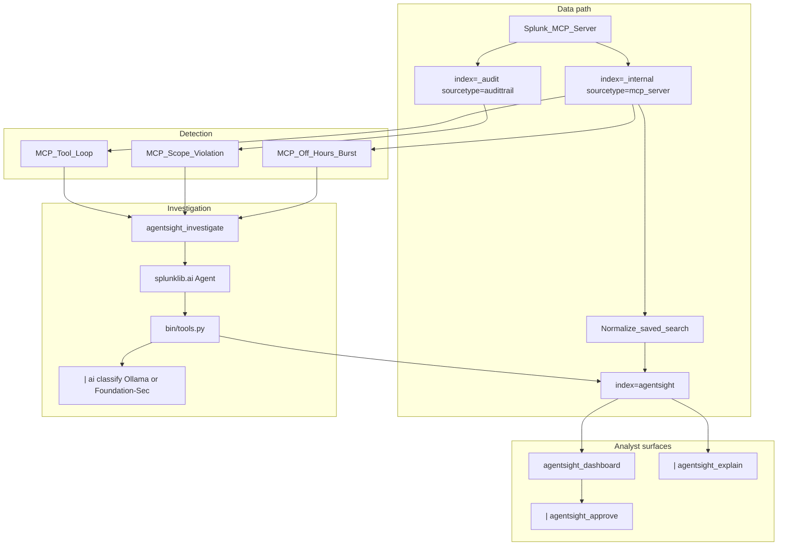

# AgentSight Architecture

**Splunk watches the agents that use Splunk.**

AgentSight is a native Splunk app for the [Splunk Agentic Ops Hackathon](https://splunk.devpost.com/) (Security track). It observes MCP clients and autonomous agents that query Splunk, detects agent-specific misbehavior, investigates with `splunklib.ai`, and supports async analyst approval.

## System diagram



## Splunk AI capabilities used

| Capability | Role in AgentSight |
|------------|-------------------|
| **Splunk MCP Server** (Splunkbase 7931) | Source of real audit telemetry (`mcp_server`, `audittrail`) |
| **`splunklib.ai` Agent** | Investigation and explain agents with local tools |
| **`| ai` command** (AI Toolkit) | `classify_agent_behavior` via Ollama (dev) or Foundation-Sec (demo) |
| **Custom alert action** | `agentsight_investigate` on detection saved searches |
| **Custom search commands** | `agentsight_approve`, `agentsight_explain` |

## Data flow

1. **MCP clients** call `splunk_run_query` via Streamable HTTP (`POST /services/mcp`).
2. **Audit logs** land in `_internal`/`mcp_server` and `_audit`/`audittrail`.
3. **Normalization** saved search copies events to `index=agentsight` / `agentsight:mcp_audit`.
4. **Detection** saved searches (every 5m) fire on runaway loops, scope violations, off-hours bursts.
5. **`agentsight_investigate`** runs an AI agent (max ~5 tool calls, 4 min budget) → indexes `agentsight:case`.
6. **Dashboard** shows live MCP timeline; analyst **approves** queued SPL via `agentsight_approve`.
7. **`| agentsight_explain`** re-explains the case in the search bar.

## Index and sourcetypes

| Sourcetype | Purpose |
|------------|---------|
| `agentsight:mcp_audit` | Normalized MCP audit events |
| `agentsight:case` | Investigation cases |
| `agentsight:investigation_step` | Agent tool audit trail |
| `agentsight:approval` | Human approve/deny decisions |
| `agentsight:demo` | Synthetic fallback only |

## Repository layout

```
agentsight/
├── ARCHITECTURE.md          # this file
├── README.md                # judge quickstart
├── LICENSE
├── scripts/                 # Day 0 + demo helpers
└── apps/agentsight/         # Splunk app (install to $SPLUNK_HOME/etc/apps/)
```

## Demo path (video)

1. `scripts/demo_mcp_burst.sh` → hero timeline spikes
2. Detection fires → `agentsight_investigate` → case `awaiting_approval`
3. Dashboard approve → follow-up SPL results
4. `| agentsight_explain case_id=...`

