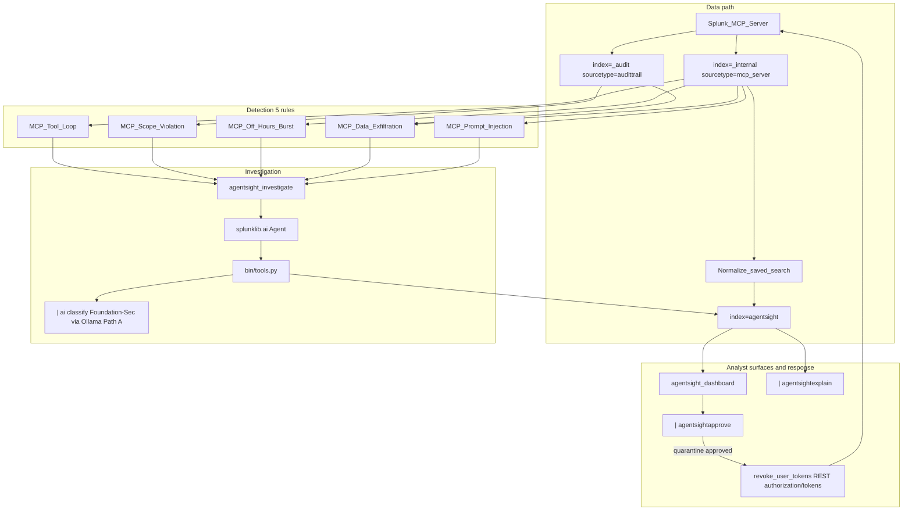

# AgentSight Architecture

**Splunk watches the agents that use Splunk.**

AgentSight is a native Splunk app for the [Splunk Agentic Ops Hackathon](https://splunk.devpost.com/) (Security track). It observes MCP clients and autonomous agents that query Splunk, detects agent-specific misbehavior, investigates with `splunklib.ai`, and supports async analyst approval.

## System diagram



## Splunk AI capabilities used

| Capability | Role in AgentSight |
|------------|-------------------|
| **Splunk MCP Server** (Splunkbase 7931) | Source of real audit telemetry (`mcp_server`, `audittrail`) |
| **`splunklib.ai` Agent** | Investigation and explain agents with local tools |
| **`| ai` command** (AI Toolkit) | `classify_agent_behavior` via Foundation-Sec open weights in Ollama (Path A); optional Splunk Hosted Models clip (Path B) |
| **Custom alert action** | `agentsight_investigate` on detection saved searches |
| **Custom search commands** | `agentsightapprove`, `agentsightexplain` |

## Data flow

1. **MCP clients** call `splunk_run_query` via Streamable HTTP (`POST /services/mcp`).
2. **Audit logs** land in `_internal`/`mcp_server` and `_audit`/`audittrail`.
3. **Normalization** saved search copies events to `index=agentsight` / `agentsight:mcp_audit`.
4. **Detection** saved searches fire on runaway loops, scope violations, off-hours bursts, MCP-attributed data-export SPL, and prompt-injection signatures in tool arguments.
5. **`agentsight_investigate`** runs an AI agent (max ~6 tool calls, 4 min budget) → indexes `agentsight:case`. For critical findings it queues a **quarantine** action alongside any read-only follow-up.
6. **Dashboard** shows live MCP timeline + KPIs; analyst **approves** a queued SPL or **quarantine** via `agentsightapprove`.
7. **Quarantine** (on approval only) calls `revoke_user_tokens` → Splunk REST `authorization/tokens` to revoke the rogue agent's tokens; case status → `contained`.
8. **`| agentsightexplain`** re-explains the case in the search bar.

## Index and sourcetypes

| Sourcetype | Purpose |
|------------|---------|
| `agentsight:mcp_audit` | Normalized MCP audit events |
| `agentsight:case` | Investigation cases |
| `agentsight:investigation_step` | Agent tool audit trail |
| `agentsight:approval` | Human approve/deny decisions |
| `agentsight:demo` | Synthetic fallback only |

## Repository layout

```
agentsight/
├── architecture_diagram.md  # this file (Devpost-required filename)
├── README.md                # judge quickstart
├── LICENSE
├── scripts/
│   ├── sh/                  # bash helpers (Linux / macOS)
│   ├── ps1/                 # PowerShell helpers (Windows)
│   └── build_app_icons.py
└── apps/agentsight/         # Splunk app (install to $SPLUNK_HOME/etc/apps/)
```

## Demo path (video)

1. `scripts/sh/demo_mcp_burst.sh` → hero timeline spikes
2. Detection fires → `agentsight_investigate` → case `awaiting_approval`
3. Dashboard approve → read-only SPL follow-up (or **quarantine** on `mcp-demo-agent` only — never on `admin`)
4. `| agentsightexplain case_id=...`

